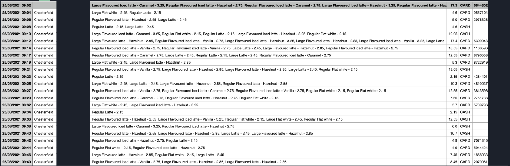
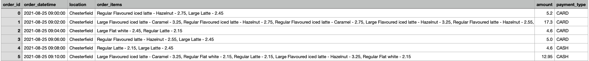

# data-cleansing
I am performing basic data cleaning on raw sales data for a small cafe. The data arrives in CSV format but contains information we cannot use and is unreadable, so needs cleaning and restructuring.
- Please note, this is dummy data, so the names and card numbers are not real and cannot be used anywhere

## What needed actioning:
- Removal of PII (Personally Identifiable Information)
- Converting datetime into correct format > yyyy/mm/dd
- Removing rows with empty fields
- Creating unique order id's
- As a bonus, I have created a second csv file which shows the top 10 orders by order amount

## Pandas and PySpark:
- I have used Pandas and PySpark libraries to perform the same tasks listed above, hence we have 2 csv files showing the same thing. These have been separated into the Pandas and PySpark folders in the directory, each folder containing the csv files that were generated using its library. This was done for practice and I intend to add more libraries in the future

## Before and after
- Below is an image showing what the raw data looks like (the PII has been covered to add to realism...)

- Below shows what the data looks like after cleaning

- Not all data is shown in the above images, please open the csv files for a full look

